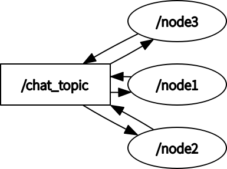

# Practice repository for ROS2
## setup 
```
$ mkdir /path/to/workspace
$ cd /path/to/workspace
$ mkdir src
$ cd src
$ git clone https://github.com/ruth561/ros2_example.git
$ colcon build
```

## how to run an executable
After setup, you run the following command on another terminal.
```
$ cd /path/to/workspace
$ source install/setup.bash
```
then, you can execute some executable with `ros2 run` command.
```
$ ros2 run sample0 chat_node
```

## sample0
This package builds a single executable file that generates a node to chat through chat_topic.
You can generate a node with the following command.
```
$ ros2 run sample0 chat_node
```
When the three nodes are activated, the situation is as shown in the graph below.


